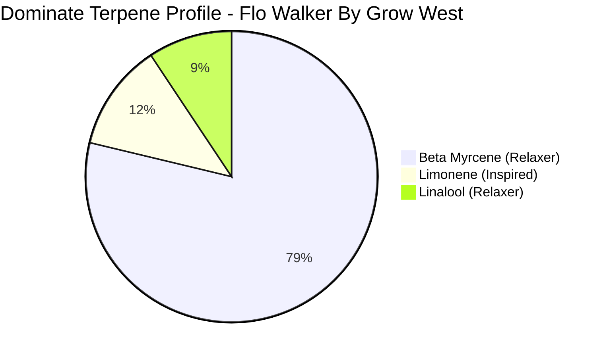

Whatever your late day wind-down cycle entails, you want your cannabis to match your vibe. If you want to watch
a movie, you need a head clear enough to let you, and possibly get up and make yourself or some companions a 
snack.

<!--truncate-->

Or maybe you just want your couch to defy physics and absorb you slowly throughout the evening &mdash; and that's totally
understandable &mdash; but can the same bud help you with both? Flo Walker by Forward Grow will definitely try
its best to meet both demands. 

## Full Relaxation Without Total Sedation

Flo walker has an *absurd* amount of the terpene Beta Myrcene, which has a relaxing and sedating effect. It's not
an inflammation killer, but it will relieve tense tired muscles and tense tired minds. However, with a significant
concetration of Limonene, Flo Walker feels (and tastes) refreshing, not sedating. 

Part of what else makes this strain successful for somewhat sociable relaxation is its THCa content. It's 
in the low 20s, which is almost a little pedestrian for medical grade cannabis, but if it were any more
powerful it wouldn't be social anymore. 

If you think this is probably on the low side for you, don't separate the kief when you grind it. 

| Cannabinoid | Amount |
| --- | --- |
| THCa | 23.51% <small>(Note that this is relative to the total THC content of the plant. If the plant itself is 35% THC, then 10% THC-A Means 10% of that 35%. for example.)</small> |
| CBD   | 0.11% |
| CBGa  | nil |

### Hacking The Effects

More limonene (once THCa has been ingested and absorbed) will boost mental clarity during the experience.

Eating foods high in beta myrcene (like mango) an hour before consumption will boost the sedating and
relaxing qualities.

## Rescue Strain

Because this strain doesn't rob you of your wits, it can be used to eliminate anxiety attacks very effectively;
you might consider this as an alternative to chemical sedatives prior to a long MRI, etc, or as a rescue from
PTSD symptoms. 

It is unfathomably difficult to feel a heightened sense of urgency about almost anything after consuming this
strain. Don't use it at work unless you're taking the rest of the day off. 

