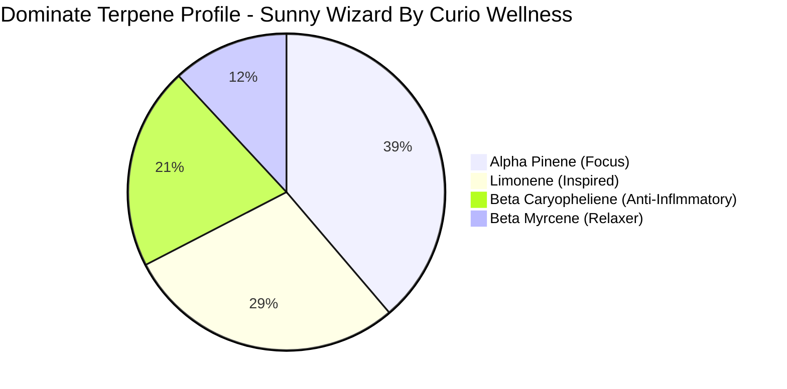

I ask a lot from a single strain of cannabis. 

I need bright, clear thinking but not the urge to be chatty. I need muscle relaxation without being 
glued to a chair. I need serious help with pain and inflammation. I have debilitating anxiety. 

I also can't afford designer weed that comes in keepsake jars, which unfortunately really narrows my options for something that really meets
my daytime needs. 

<!--truncate-->

For the longest time, only Miracle Alien Cookies really hit the spot. That's not to say that I don't like or use
other strains, in fact I love trying new things all the time, it's just that most daytime-appropriate
strains only help with a few of my symptoms. 

I'd tried Wizard Gum by Curio when I was looking for a nightcap, so when I saw other "day walkers" reviewing
this sunny cross, I knew I needed to try it. I'm glad that I did. I refer to anyone that consumes cannabis 
while working as a day walker, in homage to the movie Blade. 

## Daytime Balance With Potency 

The two most dominant terpenes are known for lending mental clarity, focus and creativity to the experience
(alpha pinene and limonene).

Next, Beta Caryopheliene relieves inflammation, followed by the least of the significant terpenes in
this strain, beta myrcene, providing relaxation and very mild sedation. 

There are other terpenes, too, it has a little linalool and humulene - [check it out on Leafly](https://www.leafly.com/brands/curio-wellness/products/curio-wellness-sunny-wizard-flower) where you can also figure
out where to buy it. It's strong enough to penetrate neuropathy, without putting you on the couch:

| Cannabinoid | Amount |
| --- | --- |
| THC | 0.44% |
| THCa | 27.27% |
| CBD   | nil |
| CBGa  | 0.23% |

### Hacking The Effects

If you want more relaxation (who doesn't want more couch occasionally anyway?) eat a mango an hour before using this strain. The 
additional beta myrcene you ingest will put you out promptly. 

There's really no more room to tweak the 'up' effects with this one as they're already at skyscraper levels, but
lemon will help refocus it.

## A Formidable Pain Killer

I not only have inflammatory issues from my immune system, I also have the problem of constant spasms ever since 
I had my second round of brain surgery. These spasms frequently become cramps, which really effects my ability
to work. Usually, I have to look to stronger indica-leaning strains to get enough relief from this to be functional,
and mix in strong citrus strains to counteract the couching. 

This strain is all of that done for me, balanced completely. I feel the muscles relax, but not give up for the day.

## ADHD Soothing

The amount of Alpha Pinene in this strain makes sure you stay bright-eyed and bushy-tailed, and it is a renewable 
effect (you can sustain it through micro-dosing throughout the day).

You feel the effect start to take hold in the back of your head, near your language center, and that's when the relaxation
starts. Then, you feel like you can get things done, similar to lifter. 

## Great Citrus-y Taste

The taste has lots of citrus with a hint of diesel and the aroma is actually somewhat subtle. It's not harsh, but like
other strans high in Beta Caryopheliene, it can tickle the throat. It doesn't have a chem-like taste like pop rocks, 
but your tongue will feel it. 

## Sunny Wizard By Curio Is Awesome!

Great any-time theraputic that hits what some have to chase multiple strains to manage, with a reasonably accessible price
and great flavor. I'm definitely putting this in my rotation when I can get it deli style at my local dispensary.  

